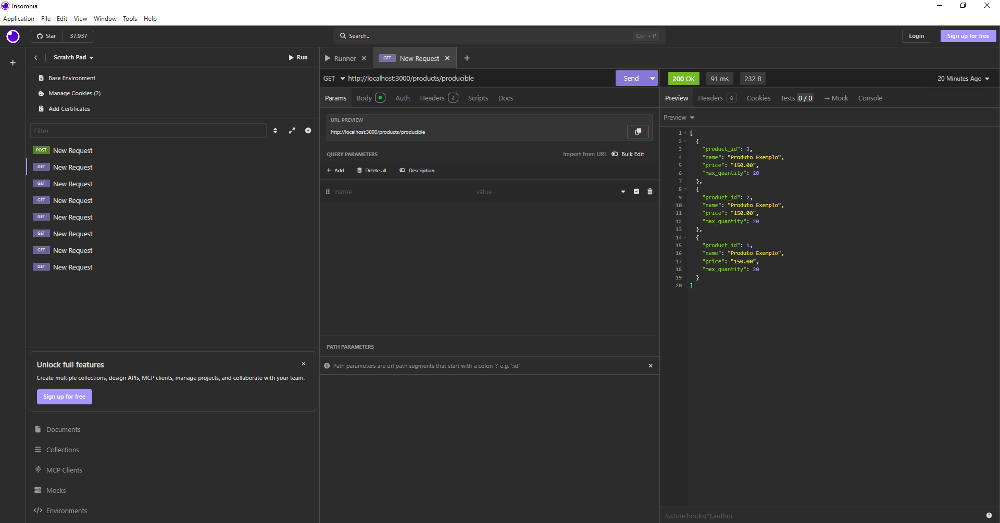
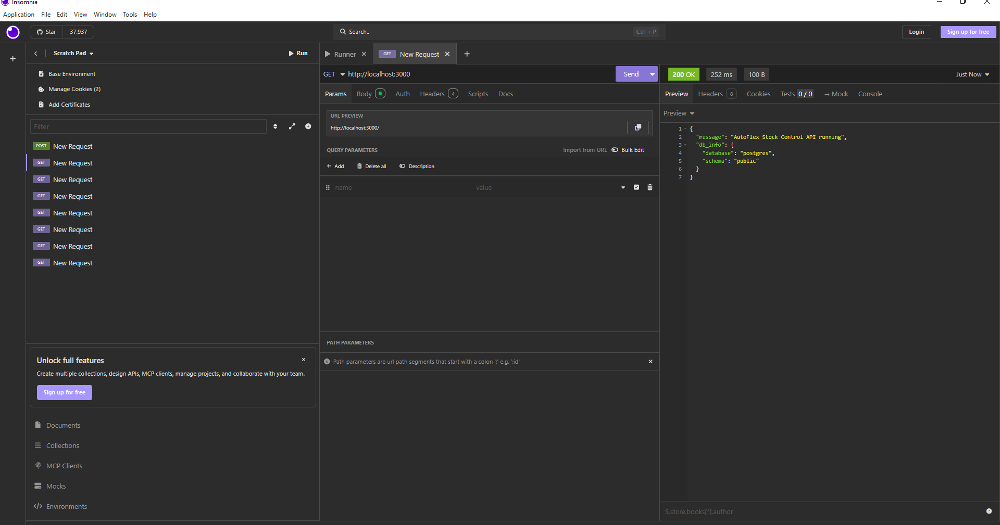
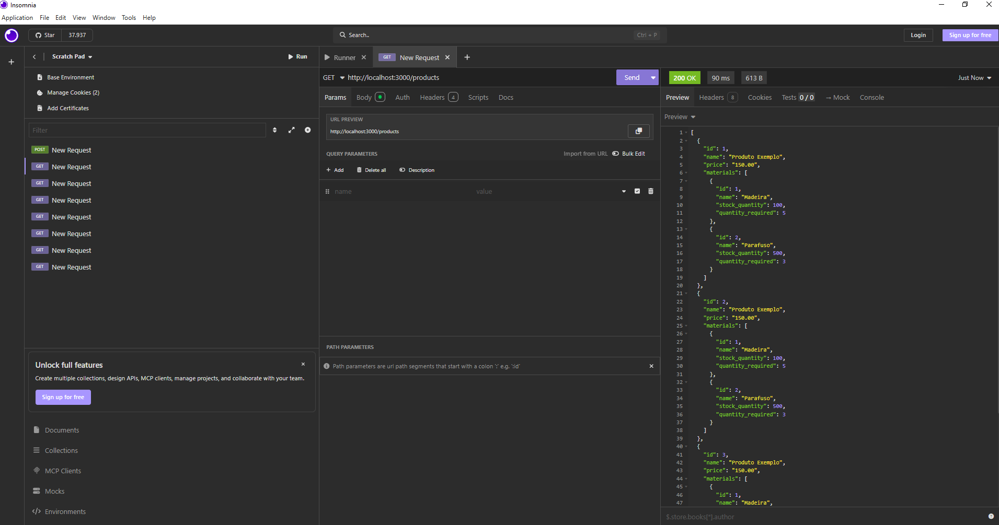

Production Control API

This is a simple backend API to manage products and raw materials.

The system controls stock and checks which products can be produced

Technologies

Node.js

Express

PostgreSQL

Project Structure
backend/
├── src/
│   ├── routes
│   ├── controllers
│   ├── services
│   └── models
├── app.js
├── server.js
└── README.md

app.js and server.js

app.js: Express config and routes

server.js: starts the server

This separation makes the project more organized.

CORS

CORS was used to avoid request blocking by the browser.

Database Pool

Pool was used to manage database connections and improve performance.

API Features

Create, list, update and delete products

Create, list, update and delete raw materials

Associate raw materials to products

Check producible products by stock

API Tests (Insomnia)

The API was tested using Insomnia.
<!-- Inserir imagens dos testes com insomnia -->

Run the Project
npm install
npm run dev

Server runs on:

http://localhost:3000